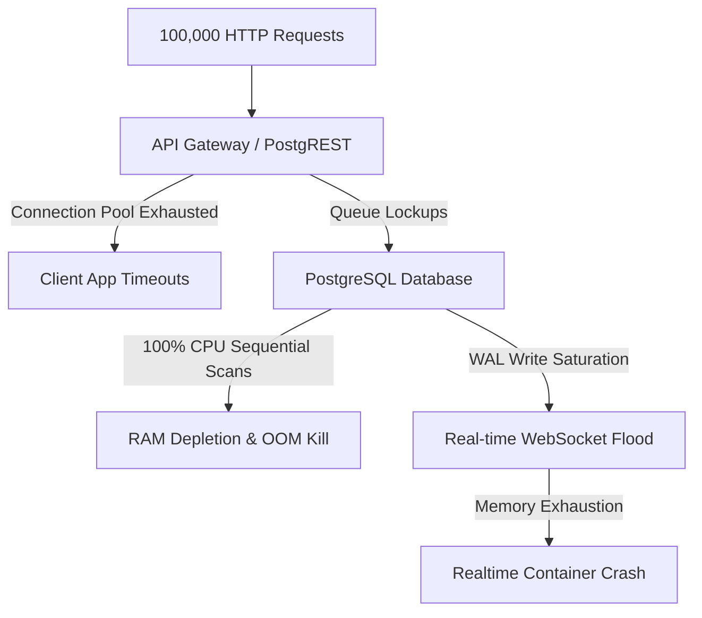

# CarryGo Architecture & Scalability Assessment: 100,000 Concurrent Requests Load Analysis

This report provides a deep-dive evaluation of the CarryGo prototype against industry-standard, hyper-scale architectures (like Zomato and Blinkit). The primary focus is **Extreme Cost-Effectiveness, Reliability, and Infrastructure Consolidation** to handle 100,000+ concurrent requests.

> [!IMPORTANT]
> **Core Objective:** Maximum Output with Minimum Cost, Minimum API Hits, High Reliability, and Minimum Vendor Fragmentation (Unified Infrastructure).

---

## 1. Architectural & Code Quality Assessment (Current State)

### Code Quality & State Management
- **The Shift to TanStack Query**: Transitioning to TanStack Query from legacy eager caching is a crucial step towards efficiency, preventing high memory footprint on the client.
- **Lack of Pagination**: Currently, queries fetch entire tables. This wastes bandwidth, RAM, and database compute on both the server and client.

### Database & Service Layer
- **Client-Heavy Pattern**: Performing sensitive logic directly from the mobile client against the database using Supabase is expensive, hard to optimize, and poses security risks.
- **Wildcard String Matching**: SQL `ilike` with leading wildcards (`%city%`) forces a **sequential table scan**, completely bypassing indexes and spiking CPU usage.

---

## 2. Load Analysis: The 100,000 Request Cascade Failure

Under 1 Lakh concurrent requests, the current direct-to-database architecture fails catastrophically:

---

## 3. The Zomato / Blinkit Model: Deep Architecture Strategy

To achieve massive scale reliably and cheaply, we must adopt an **Event-Driven, Edge-First Architecture**. Furthermore, to solve the issue of fragmented services (using Supabase, Vercel, external Redis, etc.), we must consolidate our infrastructure.

### A. Infrastructure Consolidation (The "Single Cloud" Advantage)
Using disparate vendors (e.g., Supabase for DB, Vercel for Edge Functions, Upstash for Redis) introduces two massive problems:
1. **Network Egress Costs:** Data leaving AWS to hit an external service is charged at high rates.
2. **Latency (Data Gravity):** Microservices should sit physically next to the database. Bouncing requests across the internet adds 50ms-100ms of latency per hop.

**The Solution: Unified AWS Ecosystem**
To be truly robust, low-latency, and cost-effective, we bring everything under one Virtual Private Cloud (VPC) in AWS. Internal network transfer inside a VPC is **free** and sub-millisecond.

- **CDN & Edge:** AWS CloudFront (Replaces Cloudflare)
- **API Gateway:** AWS API Gateway + AWS Lambda (BFF layer)
- **Database:** Amazon RDS for PostgreSQL (Multi-AZ)
- **Cache:** Amazon ElastiCache (Redis)
- **Message Queue:** Amazon SQS
- **Object Storage:** Amazon S3 (Images/Avatars)

### B. The BFF (Backend-For-Frontend) Layer
Mobile apps talk to AWS API Gateway -> AWS Lambda. 
- Lambda functions validate, sanitize, and drop malicious requests before they reach the RDS Database.
- **Cost Benefit:** AWS Lambda scales to zero. You pay exactly $0 when there is no traffic.

### C. Extreme Caching Strategy (Zero-Cost Reads)
Blinkit does not hit the DB when you open the app. They hit a Cache.
- **CDN Caching (CloudFront):** Cache the static/semi-static Trip and Parcel feeds. 99,999 users receive the cached feed directly from the CDN edge node closest to them.
- **Redis (ElastiCache):** For user sessions and dynamic matching, Redis handles millions of ops/sec inside the AWS VPC with single-digit millisecond latency.

### D. Write-Batching & Message Queues (SQS)
Writes are the most expensive database operations (IOPS). 
- **The Flow:** User posts a trip -> Lambda drops it into SQS -> A background worker consumes SQS, batches 500 trips together, and performs a **single bulk DB insert**. 
- **Cost Benefit:** Reduces database Write IOPS by 99%. Protects the database from sudden viral traffic spikes.

---

## 4. Deep Dive: Extreme Cost-Effectiveness & Reliability

To make this architecture "bhaut jyda cost effective" (highly cost-effective) and reliable, we implement advanced techniques:

### 1. Compute Cost Reduction: AWS Spot Instances
For the background workers consuming the SQS queues (e.g., generating matches, sending push notifications), we do not need highly available on-demand servers.
- Use **AWS EC2 Spot Instances** or Spot Fargate.
- **Why?** Spot instances utilize unused AWS capacity and are **up to 90% cheaper** than standard servers. If a Spot instance is terminated, the SQS message is simply picked up by another worker.

### 2. Database Storage Cost Reduction: Tiered Archiving
PostgreSQL SSD storage is expensive. CarryGo generates historical data rapidly (completed trips, delivered parcels).
- **Strategy:** Every 30 days, a cron job archives completed trips/parcels out of the expensive PostgreSQL database and dumps them into **Amazon S3 Glacier**.
- **Cost Benefit:** S3 Glacier costs fractions of a cent per GB, keeping the active database small, fast, and cheap.

### 3. Hyper-Scale Reliability (Multi-AZ)
To ensure 99.99% uptime, no single point of failure can exist.
- **RDS Multi-AZ:** The PostgreSQL database automatically replicates to a secondary Availability Zone (data center). If a flood/power outage hits the primary data center, AWS automatically fails over to the replica in seconds.

### 4. Smart Real-time via Push (FCM / APNs)
- **The Problem:** 1 Lakh open WebSockets (Realtime) requires expensive RAM to keep connections alive.
- **The Solution:** Use WebSockets *only* for active Chat. For trip matches or status updates, use **Firebase Cloud Messaging (FCM)**. Push notifications are essentially free and don't require persistent AWS server connections.

### 5. Minimized API Hits (Client-Side)
- **Aggressive Local Storage:** Use TanStack Query with SQLite. Don't fetch data if it hasn't changed.
- **Request Debouncing:** Wait 500ms after the user stops typing a city before hitting the search API.
- **ETags (HTTP 304):** Send ETags. If the client has the latest data, Lambda responds with `304 Not Modified` (0 bytes payload), saving massive CloudFront data transfer costs.

---

## Summary: The Unified Target State

By adopting an **All-in-AWS VPC Architecture (API Gateway -> CloudFront -> Lambda -> SQS -> RDS)**, we solve the vendor fragmentation issue. Network egress fees drop to near zero, latency becomes sub-millisecond within the VPC, and the architecture easily absorbs 100,000 concurrent requests. 

Coupled with Spot Instances for compute, S3 Glacier for old data, and heavy edge-caching, this represents the absolute pinnacle of high-output, low-cost engineering used by the industry's best.
