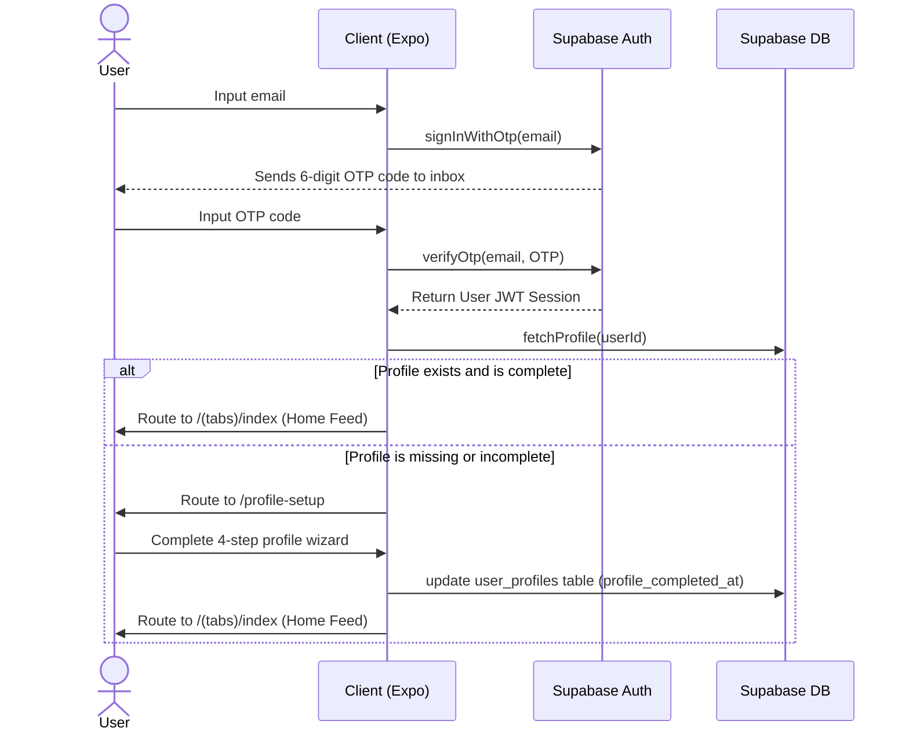
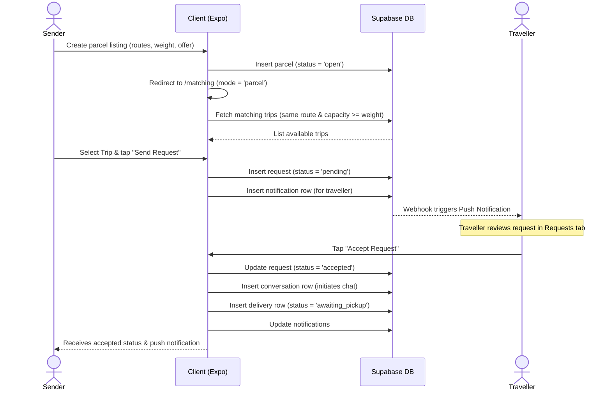
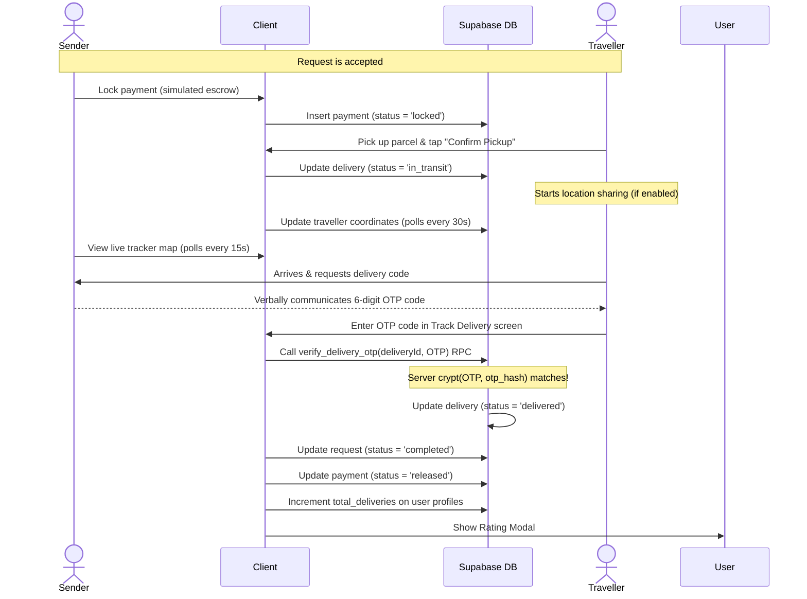

# CarryGo Deep Codebase Analysis Report

## 1. Executive Summary

CarryGo is an Expo/React Native mobile application targeting peer-to-peer parcel delivery. It allows **senders** to list packages they need shipped and **travellers** to list trips with excess luggage capacity, matching their routes using city-based string filtering. 

Currently, the project is structured as a robust, highly-interactive mobile frontend with a Supabase PostgreSQL backend. It is in the middle of a major architectural refactoring (transitioning from local state and client-side table writes to a structured, server-command-based architecture powered by **TanStack Query**).

A safety-oriented containment phase (**Phase 0**) has successfully disabled unsafe local mock flows (such as fake client-side KYC selfies, simulated Stripe escrow, and plaintext delivery OTP disclosure) and introduced secure server-side procedures (RPCs). However, substantial work remains to move CarryGo from its current state to a production-ready system.

---

## 2. Technology Stack & System Architecture

The CarryGo codebase comprises the following technologies:

### 2.1 Mobile Application Layer (Expo / React Native)
- **Expo SDK 53**: The primary framework powering iOS, Android, and Web targets.
- **Expo Router (v5.x)**: File-based routing with deep-link support and typed route schemas.
- **React Native Reanimated (v3.17)** & **Lottie**: Powers complex micro-animations (e.g., in `onboarding.tsx`, `AppTour.tsx`, and empty state cards).
- **Zustand (v5.x)**: Used for light UI state management (though currently underutilized in favor of React Context/React Query).

### 2.2 Server-State & Caching Layer (TanStack Query)
- **TanStack Query (v5.101)**: Provides caching, background synchronization, and query/mutation lifecycles.
- **QueryProvider (`lib/query/QueryProvider.tsx`)**: Integrates React Query with native device lifecycles:
  - **NetInfo integration**: Automatically pauses queries and hooks into NetInfo listeners to resume fetching when the device returns online.
  - **AppState integration**: Restarts queries and triggers refetching when the app returns to the foreground on iOS/Android.

### 2.3 Backend & Infrastructure (Supabase)
- **Supabase JS Client (`template/core/client.ts`)**: Serves as the database connection client using token persistence.
- **PostgreSQL**: Implemented with Row Level Security (RLS), custom triggers, composite indexes, and custom database RPC procedures.
- **Deno Edge Functions (`supabase/functions/`)**: Implements edge computing for push notifications.

### 2.4 Styling & Styling Tokens
- **CarryGo Theme (`constants/theme.ts`)**: Main theme system providing color tokens (`C`), typography, spacing, border radii, and shadows for light and dark modes.
- **ThemeContext (`contexts/ThemeContext.tsx`)**: Manages current theme selection, saving settings inside AsyncStorage.

---

## 3. Directory Structure & File Map

The codebase is organized as follows:

```text
CarryGo/
├── .expo/                       # Expo local cache (gitignored)
├── app/                         # Expo Router screens (routes map)
│   ├── (tabs)/                  # Main tabs: Home, Requests, Messages, Profile
│   ├── chat/                    # Group chat routes [id].tsx
│   ├── delivery/                # Delivery tracking routes [id].tsx
│   ├── parcel/                  # Parcel detail routes [id].tsx
│   ├── payment/                 # Payment detail routes [id].tsx
│   ├── trip/                    # Trip detail routes [id].tsx
│   ├── index.tsx                # Startup redirect and landing routing
│   ├── onboarding.tsx           # Slides showing app features and tour
│   ├── login.tsx                # OTP two-stage email authenticator
│   └── profile-setup.tsx        # Profile configuration wizard (4 steps)
├── features/                    # Domain logic folders (queries, schemas, actions)
│   ├── listings/                # Trip & parcel query hooks, mutations, filters
│   ├── requests/                # Request-specific query hooks and mutations
│   └── conversations/           # Messages and conversation list query hooks
├── components/                  # Shared UI widgets and compound components
│   ├── feature/                 # Large functional widgets (Tour, KYC, Rating, Cards)
│   └── ui/                      # Pure UI building blocks (Buttons, Inputs, Badges)
├── services/                    # Direct data-access layer calling Supabase APIs
│   ├── deliveries.service.ts    # Delivery OTP validation and pickup confirms
│   ├── location.service.ts      # Location polling and device coordinate fetching
│   ├── payments.service.ts      # Simulated locking, captures, and refunds
│   └── ...                      # Services for trips, profiles, notifications, etc.
├── contexts/                    # Global app providers
│   ├── AuthContext.tsx          # Handles session recovery, profile setup, OTP
│   ├── DataContext.tsx          # React Query compatibility wrapper layer
│   └── ThemeContext.tsx         # Color schemes and AsyncStorage settings
├── lib/                         # Low-level infrastructure utilities
│   └── query/                   # React Query client, provider, and keys setup
├── types/                       # Handwriting TypeScript schemas & entity contracts
├── constants/                   # Static mock data, cities list, and feature flags
├── supabase/                    # Backend database setup
│   ├── migrations/              # Database schema history and RLS scripts
│   └── functions/               # Deno push-notification function
└── scripts/                     # Lint, build, and safety-checking utilities
```

---

## 4. End-to-End Application Flows

### 4.1 Authentication & Profile Setup Flow


### 4.2 Matching & Booking Request Flow (Sender perspective)


### 4.3 Payment & Secure Delivery Flow


---

## 5. Security & Verification Analysis

### 5.1 Row-Level Security (RLS) Policy Audit
Every table in the CarryGo schema has RLS enabled by default to prevent direct client manipulation of other users' data. The policies enforce strict boundaries:

1. **`user_profiles`**: 
   - Public can select basic fields, but inserts and updates are restricted to the owner: `auth.uid() = id`.
   - Complete profiles trigger a database-level username uniqueness constraint (`user_profiles_completed_username_unique` unique index) that validates only completed profiles, preventing conflicts during registration drafts.
2. **`trips` / `parcels`**:
   - Selective viewing: trips can only be searched if `status = 'active'` or `user_id = auth.uid()`. Parcels are only visible if `status in ('open', 'matched')` or `user_id = auth.uid()`.
   - Write actions require `user_id = auth.uid()`.
3. **`requests`**:
   - Access restricted to actors involved in the match: `sender_id = auth.uid() or traveller_id = auth.uid()`.
4. **`deliveries`**:
   - Select and update privileges are limited to participants of the parent delivery request.
5. **`conversations` / `messages`**:
   - Messages can only be read or inserted if the user is listed in the conversation's `participant_ids` array.
6. **`route_subscriptions`**:
   - CRUD actions are entirely scoped to `user_id = auth.uid()`.

### 5.2 Phase 0 Security Containment Actions
Phase 0 introduced critical safety nets to allow demo usage of the app:

1. **Exposed Credentials Removal**:
   - Commented personal access tokens in `scripts/reset-project.js` were removed. 
   - Commits containing historical secrets have been separated and are flagged for BFG/git-filter-repo purging before going public.
2. **Plaintext OTP Elimination**:
   - Replaced old client-side OTP checks. The mobile client no longer reads the delivery code.
   - When a delivery is created, the database generates a random 6-digit code and stores only its bcrypt/blowfish hash (`crypt(v_code, gen_salt('bf'))`) inside the `deliveries.otp_hash` column.
   - Verification occurs server-side via the `verify_delivery_otp` definer RPC.
3. **Identity Verification & KYC Containment**:
   - Replaced the unsafe KYC document mock (which immediate-approved users based on length checks) with an informative `Unavailable-Provider` modal banner (`components/feature/KycOnboarding.tsx`).
   - Paused parcel and trip creation screens if the KYC provider toggle is enabled until a secure provider integration is established.
4. **Payment Simulation Containment**:
   - Flagged payments as mock transactions. Tapping "Lock Payment" inside `app/payment/[id].tsx` is disabled unless `FeatureFlags.payments` is explicitly enabled.
5. **Deno Edge Function Containment**:
   - Excluded Supabase functions from Metro/Expo compilation targets (handled via `.tsconfig` exclusions).

---

## 6. Technical Debt & Quality Issues

A thorough analysis of the source code reveals several areas of technical debt:

### 6.1 Screen bloatedness and mixed concerns
Several screen controllers are unnecessarily large and combine navigation, UI state, Supabase queries, local animations, permission prompts, and UI layouts:
- `app/delivery/[id].tsx` is **726 lines** of code. It contains map logic, OTP forms, polling setups, rating updates, and safety banner checks.
- `app/trip/[id].tsx` is **460 lines** of code.
- `app/subscriptions.tsx` is **643 lines** of code.

*Recommendation*: These should be refactored into smaller, separate visual components (e.g., `DeliveryHeader`, `DeliveryTimeline`, `OtpVerificationForm`, `TrackingMap`) and custom hooks (e.g., `useDeliveryTracker`).

### 6.2 Polling Multiplicity
Currently, polling is handled client-side in separate hooks:
- Multiple instances of `useNotifications` each create their own 30-second interval timers querying the `notifications` table.
- `app/subscriptions.tsx` sets up its own 30-second polling loop checking all active subscriptions against trips and parcels.
- Senders poll for coordinates every 15 seconds, and travellers update locations every 30 seconds.

*Recommendation*: Consolidate database polling. In subsequent phases, transition these features to **Supabase Realtime** listener subscriptions (WebSockets) to eliminate battery drain and database overhead.

### 6.3 Non-Atomic Multi-Step Workflows
When a traveller accepts a request, the client executes several independent queries sequentially:
```typescript
await updateRequestStatusMutation.mutateAsync({ requestId, status: 'accepted' });
await createConversationMutation.mutateAsync({ ... });
await createDelivery(requestId);
await createNotification({ ... });
```
If any network error occurs mid-way through this sequence, the database is left in a corrupted or inconsistent state (e.g., request status is `'accepted'`, but no conversation exists, or no delivery record is instantiated).

*Recommendation*: Multi-table mutations must be wrapped in a trusted server transaction or handled via database triggers (e.g., a trigger on `requests` that automatically inserts a `delivery` and `conversation` row when status becomes `'accepted'`).

### 6.4 Dependency Bloat & Unused Packages
`package.json` contains 131 dependencies, including several competing and unused libraries:
- Caching/API frameworks: `@tanstack/react-query` is active, but `Apollo Client` and `GraphQL` are also listed.
- State management: `zustand` is installed alongside `redux`.
- Unused SDKs: `@stripe/stripe-react-native`, WebRTC, and Signal protocol wrapper packages are present but not integrated into the runtime logic.

---

## 7. Future Roadmap & Implementation Phases

The recommended path to bring CarryGo to production is structured as follows:

```mermaid
chronology-horizontal
    title CarryGo Production Roadmap
    Phase 0 - Containment : Done. Disabled unsafe mocks, secured OTP hashing, removed leaked tokens.
    Phase 1 - Foundation : Done. Added local migration setup, RLS test runner, CI configs.
    Phase 2 - Client Refactor : In Progress. Migrate pages from useData to Query Hooks, add auth guards.
    Phase 3 - Server Commands : Next. Move multi-step writes to DB transactions & triggers.
    Phase 4 - Realtime & Push : Next. Implement WebSockets for chat and integrate Deno notification workers.
    Phase 5 - KYC & Payments : Final. Add real Stripe/M-Pesa gateways and KYC providers.
```

### Phase 2: Client Architecture Refactoring (Current Phase)
1. **Screen-by-Screen Hook Migration**:
   - Complete the refactoring of detail pages (`app/trip/[id].tsx` and `app/parcel/[id].tsx`) to fetch data directly via `useTripQuery` and `useParcelQuery`, bypassing the global compatibility bridge.
2. **Authenticated Route Guards**:
   - Implement an Expo Router layout group (`(auth)`) to protect authenticated pages, preventing unauthenticated access rather than checking redirects per screen.
3. **Pagination & Infinite Scroll**:
   - Upgrade query hooks to use `useInfiniteQuery` with offset/limit parameters for marketplace feeds and conversation pages, preventing full-table scans.

### Phase 3: Transactional Server Commands
1. **Database Triggers for Workflows**:
   - Write a PL/pgSQL trigger on the `requests` table: when status changes to `'accepted'`, automatically insert rows into `conversations` and `deliveries` in a single database transaction.
2. **Trip Capacity Constraints**:
   - Implement row locking (`SELECT FOR UPDATE`) or an atomic SQL function to decrement a trip's `available_capacity` when a parcel request is accepted, preventing overallocation.

### Phase 4: Realtime Communication & Push Notifications
1. **Supabase Realtime Chat**:
   - Re-architect chat screens to subscribe to Supabase channel events. When a message is inserted, update the screen state reactively via WebSockets.
2. **Production Notification Service**:
   - Set up Deno Edge Functions using webhook signatures to process notifications from a Postgres outbox table. Persist device tokens in a dedicated `user_devices` table.

### Phase 5: KYC and Payment Provider Integration
1. **Compliant KYC Provider Integration**:
   - Connect a hosted KYC system (e.g., Persona or Stripe Identity) to securely collect selfies and document photos via webhooks.
2. **Payment Gateway Integration**:
   - Implement a payment processor (e.g., Stripe, M-Pesa, or Razorpay) using server-side signatures, webhook listeners, and reconciliation ledgers.
