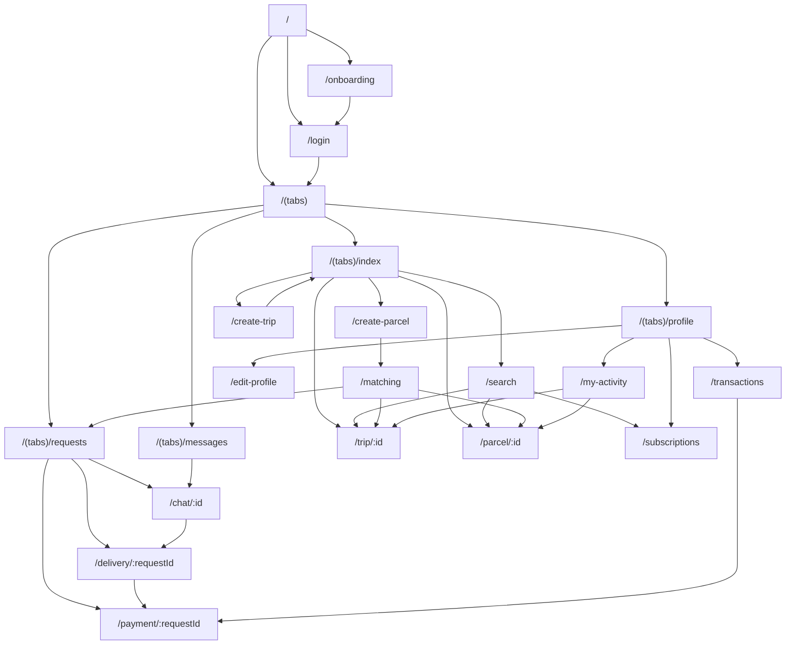

# CarryGo Codebase Quality, Application Flow, and Production Architecture Report

Date: 2026-06-07  
Repository: `CarryGo`  
Review scope: 110 tracked files, 85 TypeScript/TSX files, approximately 15,900 TypeScript lines

## 1. Executive Summary

CarryGo is a polished Expo/React Native prototype for peer-to-peer parcel delivery. It has a broad product surface:

- Email OTP authentication
- Sender and traveller roles
- Trip and parcel listings
- Route-based matching
- Delivery requests
- Chat
- KYC onboarding
- Delivery tracking
- OTP delivery confirmation
- Payment/escrow presentation
- Ratings
- Route subscriptions
- Push and local notifications
- Light and dark themes
- Web, Android, and iOS targets

The current implementation is not production-ready. The UI is significantly more complete than the backend and domain model. Most sensitive business operations are performed directly by the mobile client against Supabase tables. The repository does not include database migrations, constraints, row-level security policies, storage policies, RPCs, or a reproducible backend schema.

### Launch-readiness score

| Area | Score | Summary |
|---|---:|---|
| Product coverage | 8/10 | Broad and coherent prototype functionality |
| UI consistency | 7/10 | Strong presentation, but mixed theme systems and oversized screens |
| Application architecture | 4/10 | Clear folders, but business logic is spread across screens, contexts, and services |
| Backend architecture | 2/10 | Direct client writes; no source-controlled schema or transactional workflows |
| Security and privacy | 1/10 | Exposed delivery OTP, simulated KYC, tracked environment file, leaked PAT |
| Reliability | 3/10 | Multi-step operations are non-atomic and errors are frequently ignored |
| Scalability | 3/10 | Full-table reads, global arrays, polling, and no pagination |
| Testability | 1/10 | No test framework, test files, fixtures, or CI checks |
| Deployment readiness | 2/10 | Placeholder app identity, no EAS configuration, no verified build |
| Overall | 3/10 | Functional prototype requiring backend and architecture hardening before launch |

### Immediate conclusion

Do not launch the current build with real users, identity documents, location data, or money. The application can be used for controlled demonstrations with clearly labelled simulated features.

## 2. Immediate Security Actions

These actions should happen before feature development.

### P0-1: Revoke the exposed GitHub credential

[`scripts/reset-project.js`](../scripts/reset-project.js) contains a GitHub personal access token inside a commented repository URL. The token also exists in the initial Git commit, so deleting the current line is insufficient.

Required action:

1. Revoke the token in GitHub immediately.
2. Remove the credential from the current file.
3. Rewrite Git history with `git filter-repo` or BFG.
4. Force-push the cleaned history.
5. Run secret scanning over all refs.
6. Enable GitHub secret scanning and push protection.

Never include the token value in tickets, logs, or documentation.

### P0-2: Stop exposing delivery OTP values

[`services/deliveries.service.ts`](../services/deliveries.service.ts) returns `otp_code` to every client that can fetch a delivery. [`app/delivery/[id].tsx`](../app/delivery/[id].tsx) displays the same code to both sender and traveller, while the traveller is also asked to enter it.

The OTP currently provides no security.

Required design:

- Generate the OTP server-side with a cryptographically secure generator.
- Store only a salted hash.
- Return the plaintext once to the receiving party only.
- Verify through an authenticated server RPC.
- Rate-limit attempts and lock after repeated failures.
- Record verification attempts in an audit log.
- Never return the expected OTP to the traveller.

### P0-3: Remove simulated KYC claims

[`components/feature/KycOnboarding.tsx`](../components/feature/KycOnboarding.tsx) states that identity data is encrypted, facial matching occurs, photos are not stored, and approval takes time. The actual implementation:

- Generates fake `simulated://` photo URIs.
- Does not upload the captured photo values during submission.
- Sends the ID number directly to `user_profiles`.
- Immediately marks the profile verified and approved.

This is a material mismatch between UI claims and implementation.

Required action:

- Replace the screen with an explicitly labelled demo flow until a real provider exists, or disable it.
- Do not collect real ID numbers or selfies in the current implementation.
- Use a compliant KYC provider and server-side webhook verification.
- Store provider references and verification state, not raw identity documents in a general profile row.

### P0-4: Do not describe database rows as escrow

[`services/payments.service.ts`](../services/payments.service.ts) only creates and updates rows in a `payments` table. It does not charge, hold, transfer, or refund money.

Required action:

- Rename current behavior to "payment simulation" in demo builds.
- Implement payment-provider operations on a trusted backend.
- Use idempotency keys and signed provider webhooks.
- Do not let clients directly release or refund payment records.
- Obtain appropriate legal review before marketing any mechanism as escrow.

### P0-5: Source-control the backend security model

The repository has no Supabase migrations or RLS policies. Production authorization cannot be reviewed or reproduced.

Required files:

```text
supabase/
  config.toml
  migrations/
  seed.sql
  tests/
    rls/
  functions/
```

Every table must have RLS enabled and policy tests committed.

## 3. Current System Architecture

### Runtime provider hierarchy

[`app/_layout.tsx`](../app/_layout.tsx) mounts:

```text
AlertProvider
  SafeAreaProvider
    ThemeProvider
      AuthProvider
        DataProvider
          AppStack
```

Responsibilities:

- `AlertProvider`: native mobile alerts and a custom web modal.
- `ThemeProvider`: stores light/dark selection in AsyncStorage.
- `AuthProvider`: manages Supabase session and profile loading.
- `DataProvider`: fetches and stores trips, parcels, requests, conversations, and messages.
- `AppStack`: declares Expo Router screens and header behavior.

### Current data path

```text
Screen/component
  -> Context action or service function
    -> Shared Supabase client
      -> Direct table select/insert/update/delete
        -> Local React state update
```

The application has almost no trusted server-side domain layer. The push notification Edge Function is the only backend function in source control.

### Current folder responsibilities

| Folder | Current responsibility | Assessment |
|---|---|---|
| `app/` | Routes, UI, orchestration, business workflows | Too much logic inside screens |
| `components/` | Shared feature and UI components | Useful base, but theme and domain coupling need cleanup |
| `contexts/` | Auth, server data, theme | `DataContext` is becoming a global server-state cache |
| `hooks/` | Context access, matching, notifications, theme | Notifications hook creates duplicate global side effects |
| `services/` | Direct Supabase table access | Needs repository/API boundaries and generated database types |
| `types/` | Handwritten domain interfaces | Can drift from the database |
| `constants/` | Design tokens, mock data, cities | Duplicate theme systems and stale mock records |
| `template/` | Generated Supabase auth/client and alert SDK | Mostly unused auth framework plus active client/alert utilities |
| `supabase/functions/` | Push notification Edge Function | Missing authentication and deployment configuration |

## 4. Route and Navigation Map

### Route graph



### Route-by-route report

#### [`app/_layout.tsx`](../app/_layout.tsx)

- Root provider composition and stack declaration.
- Applies theme-sensitive headers to selected stack screens.
- Does not implement an authenticated route boundary.
- Some routes use stack headers while others implement custom headers, producing inconsistent navigation ownership.
- No global error boundary, network banner, analytics boundary, or query client.

#### [`app/index.tsx`](../app/index.tsx)

- Startup redirector.
- Waits for authentication loading.
- Authenticated users go to `/(tabs)`.
- Unauthenticated users go to onboarding once, then login.
- Uses a 120 ms timer that is not functionally necessary.
- If profile loading fails while a Supabase session exists, routing can incorrectly return to login.

#### [`app/onboarding.tsx`](../app/onboarding.tsx)

- Three animated onboarding slides.
- Stores `carrygo_onboarding_seen` in AsyncStorage.
- Routes to login after skip or completion.
- Presentation is polished.
- Claims about OTP and escrow are not aligned with actual implementation.
- Animations loop continuously and are not stopped explicitly when slides unmount.

#### [`app/login.tsx`](../app/login.tsx)

- Two-stage email and OTP UI.
- Calls `AuthContext.sendOTP` and `verifyOTP`.
- Assumes a four-digit OTP.
- Supabase OTP length and email template must be configured to match this assumption.
- No resend cooldown, attempt limit, abuse protection, captcha, or email-delivery status.
- Error text intentionally hides the actual verification error.
- Directly routes to tabs after verification without confirming that the application profile loaded successfully.

#### [`app/(tabs)/_layout.tsx`](<../app/(tabs)/_layout.tsx>)

- Configures Home, Requests, Messages, and Profile tabs.
- Computes pending request and unread message badges.
- Displays a KYC alert dot.
- Calls `useNotifications`, creating polling and notification listeners.
- Does not redirect unauthenticated users.
- Badge counts are derived from potentially stale `DataContext` state.

#### [`app/(tabs)/index.tsx`](<../app/(tabs)/index.tsx>)

- Main marketplace feed.
- Shows greeting, profile/KYC status, quick actions, notification panel, filters, trip cards, parcel cards, and first-use app tour.
- Uses `DataContext` filtered arrays.
- Instantiates `useNotifications`, while the tab layout and notification panel also instantiate it.
- The notification panel does not deep-link when a notification row is tapped.
- Home filtering happens in memory and does not paginate.
- `myTrips` and `myParcels` are calculated but the source queries exclude historical records.

Local components:

- `NotificationPanel`: notification list and mark-all-read action.
- `FilterPanel`: city and vehicle filters.
- `ActionCard`: animated quick-action tile.
- `EmptyFeed`: feed empty state and filter reset.

#### [`app/(tabs)/requests.tsx`](<../app/(tabs)/requests.tsx>)

- Separates incoming and outgoing requests.
- Supports status filters, pull-to-refresh, accept, reject, chat, delivery, and payment navigation.
- Accept performs four independent writes: request status, conversation, delivery, and notification.
- Errors are ignored during the accept/reject workflows.
- Calls a local request notification after writing a remote notification, causing confusing or duplicate behavior.
- Delivery creation can be duplicated from other routes.

#### [`app/(tabs)/messages.tsx`](<../app/(tabs)/messages.tsx>)

- Displays conversations from `DataContext`.
- Derives unread state from one shared `last_message_read` field.
- Routes to chat.
- No realtime subscription.
- Conversation sorting falls back to string-sorting IDs.
- Empty state routes to create a parcel or trip.

#### [`app/(tabs)/profile.tsx`](<../app/(tabs)/profile.tsx>)

- User identity card, KYC banner, stats, activity links, route alerts, theme toggle, tour replay, and logout.
- KYC state is based on the unsafe auto-approval implementation.
- Stats use active/open context data rather than complete user history.
- Returns `null` when the profile is absent instead of showing recovery UI.
- Logout clears auth state but does not clear `DataContext` user data.

Local components:

- `MenuItem`: reusable settings/activity row.
- `StatCard`: compact profile metric.

#### [`app/create-parcel.tsx`](../app/create-parcel.tsx)

- Creates parcel listings after a client-side KYC check.
- Collects route, category, description, weight, and offer price.
- Routes to matching after creation.
- Does not validate finite positive numeric values or maximum ranges.
- Does not upload a parcel image despite `Parcel.imageUri`.
- KYC enforcement exists only in the client.
- City selection comes from a static mock-data constant.

Local component:

- `CityPicker`: searchable modal city selector.

#### [`app/create-trip.tsx`](../app/create-trip.tsx)

- Creates trip listings after a client-side KYC check.
- Collects route, date, time, vehicle, capacity, and price/kg.
- Notifies route subscribers after creation.
- Route subscriber notifications are generated by the client and can partially fail.
- Does not reserve capacity or validate overlapping trips.
- Does not call `incrementTripCount`, so stored profile totals can drift.
- Uses date and time strings instead of one timezone-aware timestamp.

Local components:

- `DateTimePicker`: custom calendar/time modal.
- `CityPicker`: duplicated city-selection implementation.

#### [`app/matching.tsx`](../app/matching.tsx)

- Supports three modes:
  - `parcel`: find trips for an existing parcel.
  - `trip`: find parcels for an existing trip.
  - `browse_trips`: browse a route before creating a parcel.
- Matching uses city string equality/substring filtering and capacity checks.
- Duplicate request prevention is local and race-prone.
- Request creation trusts client-supplied sender, traveller, names, and price.
- No database uniqueness guarantee is visible.
- Does not account for already accepted capacity.

Local component:

- `EmptyMatches`: no-results presentation.

#### [`app/search.tsx`](../app/search.tsx)

- Local search across trips and parcels already loaded in `DataContext`.
- Supports route, vehicle type, result tabs, search history, popular routes, and route subscription.
- Search history is stored unencrypted in AsyncStorage.
- `JSON.parse` is not guarded against corrupted stored data.
- Search is not server-side and cannot scale to large datasets.
- No pagination, ranking, geospatial matching, or typo normalization.

Local components:

- `CityDropdown`: city autocomplete result list.
- `HistoryChip`: saved route chip.

#### [`app/trip/[id].tsx`](../app/trip/[id].tsx)

- Displays trip details and requests associated with a trip.
- Owners accept/reject requests.
- Non-owners can browse route-compatible parcels.
- Independently reimplements the same accept workflow as the Requests screen.
- Fetches parcel details only from context arrays; referenced parcels can be missing.
- Missing trip IDs produce an indefinite spinner rather than a not-found state.

Local components:

- `RequestItem`: request summary and actions.
- `SummaryChip`: request status count.
- `Section`: grouped request section.

#### [`app/parcel/[id].tsx`](../app/parcel/[id].tsx)

- Displays parcel details, status timeline, and related requests.
- Sender can cancel pending requests.
- Other users can open matching to offer carriage.
- Uses context data to resolve the parcel, so cold deep links are fragile.
- Missing parcel IDs produce an indefinite spinner.
- Parcel status is not automatically synchronized with accepted/completed requests.

Local component:

- `RequestRow`: parcel-specific request and workflow actions.

#### [`app/chat/[id].tsx`](../app/chat/[id].tsx)

- Displays grouped chat messages and sends new messages.
- Loads messages only once because `DataContext.loadMessages` caches by conversation ID.
- Has no Supabase Realtime subscription.
- Calls `sendChatNotification`, which schedules a local notification on the sender's own device rather than notifying the other participant.
- Copy action provides haptic feedback but does not copy text.
- No message delivery state, retry queue, attachment support, moderation, block/report, or pagination.

Local utilities/components:

- `getDayLabel`: Today/Yesterday/date grouping.
- `formatTime`: local time formatting.
- `buildListItems`: inserts day separators.
- `MessageBubble`: renders message ownership and read state.

#### [`app/delivery/[id].tsx`](../app/delivery/[id].tsx)

- Uses a request ID as the route parameter.
- Creates or fetches a delivery.
- Supports pickup confirmation, location sharing, location polling, OTP completion, payment release, notifications, and ratings.
- This is the highest-risk screen in the repository.
- OTP is disclosed to both parties and validated on the client.
- Completion triggers many independent writes without a transaction.
- Both sender and traveller delivery counters are incremented.
- Location updates occur every 30 seconds while the screen remains mounted; this is not background tracking.
- Sender polls location every 15 seconds.
- Location access and retention are not protected by a source-controlled policy.
- A failed payment release does not prevent delivery from appearing completed.

Local components:

- `DeliveryTimeline`: visual delivery state progression.
- `OtpDisplay`: reveal/hide OTP card.
- `OtpEntry`: six-digit input.
- `SimulatedMap`: map or web fallback with location metadata.

#### [`app/payment/[id].tsx`](../app/payment/[id].tsx)

- Presents payment status and transaction details.
- Sender can create a locked payment row.
- Sender or traveller can refund a locked payment.
- No payment provider is called.
- `releasePayment` is imported but completion release occurs from the delivery screen.
- Direct URL access depends on the request already existing in `DataContext`.
- No idempotency, authorization, dispute process, payment method, ledger, provider reference, or webhook state.

Local component:

- `PaymentStatusBadge`: locked/released/refunded status display.

#### [`app/transactions.tsx`](../app/transactions.tsx)

- Fetches user payment rows.
- Groups transactions by month and calculates earned/spent totals.
- Links to payment detail.
- Numbers represent database status rows, not verified financial transactions.
- No server pagination or incremental loading.

Local components:

- `groupByMonth`: transaction section creation.
- `SummaryCard`: aggregate totals.
- `TxRow`: transaction row.
- `MonthHeader`: monthly summary.

#### [`app/subscriptions.tsx`](../app/subscriptions.tsx)

- Creates, toggles, deletes, and displays route subscriptions.
- Polls trips and parcels every 30 seconds for every active subscription.
- Polling continues while the screen is mounted and duplicates server work.
- New-match detection resets across app sessions and can generate inaccurate alerts.
- A scalable implementation should match routes server-side and deliver events through push/realtime.

Local components:

- `CityPicker`: route city selector.
- `SubCard`: subscription status and match preview.

#### [`app/my-activity.tsx`](../app/my-activity.tsx)

- Displays current user's trips, parcels, requests, and computed earnings.
- "Delete trip" only changes status to cancelled.
- "Delete parcel" changes status to failed.
- Fetch services exclude most historical statuses, so this page cannot reliably show complete history.
- Earnings are calculated from completed request prices, not released payment records.

Local components:

- `EarningsSummary`: derived activity totals.
- `TripRow`: trip status/actions.
- `ParcelRow`: parcel status/actions.
- `EmptyActivity`: no-activity state.

#### [`app/edit-profile.tsx`](../app/edit-profile.tsx)

- Updates username and phone.
- Optimistically updates `AuthContext` after success.
- Does not verify phone ownership.
- No avatar upload despite avatar UI and `User.avatar`.
- Profile edits directly target a user ID supplied by the client.

#### [`app/+not-found.tsx`](../app/+not-found.tsx)

- Branded unknown-route fallback.
- Routes back to `/`.
- Dynamic entity pages do not use this fallback when records are missing.

## 5. End-to-End Application Flows

### 5.1 Startup and authentication

```text
RootLayout mounts providers
  -> AuthProvider calls Supabase getSession
  -> If session exists, fetch user_profiles row
  -> Index waits for isLoading
  -> Authenticated: tabs
  -> Unauthenticated and unseen onboarding: onboarding
  -> Unauthenticated and onboarding seen: login
```

Problems:

- The profile row is assumed to exist, but its trigger/migration is not in the repository.
- A valid auth session plus a missing profile results in `user = null`.
- `onAuthStateChange` awaits profile and notification operations inside the callback.
- Push registration is performed here and again in notification hooks.

### 5.2 Sender flow

```text
Home
  -> Create Parcel
  -> Client checks KYC flag
  -> Client inserts parcel
  -> Matching fetches trips
  -> Client inserts request
  -> Traveller accepts
  -> Client updates request
  -> Client creates conversation
  -> Client creates delivery and OTP
  -> Sender opens payment
  -> Client creates "locked" payment row
  -> Traveller confirms pickup
  -> Traveller enters OTP
  -> Client completes delivery/request
  -> Client releases payment row
  -> Client updates counters
  -> Client creates notification
  -> Rating modal
```

Critical gaps:

- No server-side authorization or state machine is visible.
- No atomic accept or completion transaction.
- No actual payment operation.
- OTP is disclosed to the traveller.
- Parcel status and capacity are not consistently updated.

### 5.3 Traveller flow

```text
Home
  -> Create Trip
  -> Client checks KYC flag
  -> Client inserts trip
  -> Client queries route subscribers
  -> Client inserts notifications
  -> Matching fetches parcels
  -> Traveller sends offer/request
  -> Request accepted
  -> Chat and delivery
  -> Pickup and optional foreground location sharing
  -> OTP completion
  -> Simulated payment release and rating
```

Critical gaps:

- Client can claim another user's identity in request payload fields.
- Capacity is not reserved.
- A trip can accept incompatible or excessive requests.
- Route matching uses static city strings, not route geometry.

### 5.4 Messaging flow

```text
Accepted request
  -> Create conversation row
  -> Messages tab reads conversation summaries
  -> Chat fetches messages once
  -> Sending inserts message
  -> Sending separately updates conversation summary
```

Problems:

- Conversation creation is race-prone.
- Message insertion and summary update are non-atomic.
- No realtime delivery.
- Read state is stored globally rather than per participant.
- Local notification is sent to the sender's current device.

### 5.5 Notification flow

```text
Client inserts notifications row
  -> Database webhook is expected to call Edge Function
  -> Edge Function uses service-role client
  -> Reads user push token
  -> Sends Expo push
  -> Client polls notifications table every 30 seconds
```

Problems:

- Webhook configuration is not source-controlled.
- Edge Function accepts arbitrary payload records and has broad CORS.
- No webhook secret or explicit caller validation is implemented in code.
- No push receipts, retry queue, deduplication, or invalid-token cleanup.
- Multiple `useNotifications` instances create multiple polling timers/listeners.

## 6. Domain Model and State Transitions

### Entities currently represented

| Entity | Purpose | Current concerns |
|---|---|---|
| `User` | Profile, reputation, KYC, push token | Sensitive KYC fields mixed into public profile |
| `Trip` | Traveller route and capacity | Date/time strings; capacity not reserved |
| `Parcel` | Sender listing | Image flow not implemented; status drift |
| `Request` | Match/offer between parcel and trip | Client controls identities, price, and status |
| `Delivery` | Pickup, location, OTP, completion | OTP exposed; location privacy; client completion |
| `Conversation` | Participant and summary metadata | Array participants and global read flag |
| `ChatMessage` | Message content | No realtime, pagination, moderation, or per-user state |
| `Payment` | Simulated lock/release/refund | Not a financial ledger |
| `Rating` | Post-delivery reputation | Duplicate recalculation and no visible uniqueness |
| `Notification` | In-app and push event | No delivery lifecycle |
| `RouteSubscription` | Route alert | Client polling instead of server matching |

### Required state machines

#### Request

```text
pending -> accepted
pending -> rejected
pending -> cancelled
accepted -> completed
accepted -> cancelled_by_support
accepted -> failed
```

Only a trusted server operation should transition state. Each transition must validate actor, current status, parcel status, trip capacity, and payment requirements.

#### Parcel

```text
draft -> open -> reserved -> in_transit -> delivered
                  \-> cancelled
open -> expired
in_transit -> failed
```

#### Delivery

```text
created -> pickup_ready -> picked_up -> in_transit -> delivered
                                      \-> failed
```

#### Payment

```text
created -> requires_action -> authorized/held -> captured/released
                                     \-> voided/refunded
```

Provider webhook state should be authoritative.

#### KYC

```text
not_started -> draft -> submitted -> provider_pending
                                  -> approved
                                  -> rejected
                                  -> needs_resubmission
                                  -> expired
```

## 7. Shared Component Report

### Feature components

#### [`components/feature/TripCard.tsx`](../components/feature/TripCard.tsx)

- Displays route, vehicle, date/time, capacity, traveller, rating, and price/kg.
- Supports press animation and optional request action.
- Strong reusable presentation.
- Uses string dates and assumes valid rating/name fields.
- `compact` prop exists but is not used in rendering.

#### [`components/feature/ParcelCard.tsx`](../components/feature/ParcelCard.tsx)

- Displays category, route, description, status, weight, offer, sender, and creation date.
- Supports optional carry action.
- Status styling does not fully cover all parcel states.
- Date formatting is performed per render.

#### [`components/feature/RequestCard.tsx`](../components/feature/RequestCard.tsx)

- Displays incoming/outgoing request details and status.
- Supports accept/reject swipe gestures and workflow buttons.
- Business actions are exposed through callbacks.
- Swipe closure captures `showSwipeHint` from the initial render because `PanResponder` is created once.
- Gesture acceptance/rejection should not begin an irreversible operation without a clear confirmation and server idempotency.
- `cardOpacity` is declared but unused.

#### [`components/feature/RatingModal.tsx`](../components/feature/RatingModal.tsx)

- Five-star rating with optional comment.
- Directly performs rating and profile updates.
- Ignores submission errors.
- Recalculates rating twice because `submitRating` already performs recalculation.
- Uses static dark theme colors, so it does not correctly support light mode.
- No duplicate-rating prevention in this component.

#### [`components/feature/KycOnboarding.tsx`](../components/feature/KycOnboarding.tsx)

- Five-step personal details, ID type, ID number, ID photo, and selfie flow.
- Includes `StepIndicator` and `CameraSimulator`.
- Entire photo flow is simulated.
- Captured photo values are not sent in `handleSubmit`.
- UI security claims are false relative to implementation.
- Validation is only length-based.
- Phone value is collected but not submitted by `submitKyc`.
- The button label says "Skip Photo" on step 4 even though the handler blocks progress without a photo.

#### [`components/feature/AppTour.tsx`](../components/feature/AppTour.tsx)

- Five-step product tour with swipe and animation.
- `useAppTour` persists completion in AsyncStorage.
- Strong reusable onboarding UX.
- Contains product claims that are not currently true.
- Looping animations are not explicitly stopped.
- `ScrollView` is imported but unused.

### UI components

#### [`components/ui/Button.tsx`](../components/ui/Button.tsx)

- Shared variants, sizes, loading, disabled, and full-width behavior.
- Uses static dark `Colors`, not the active theme.
- Props use `ViewStyle` rather than `StyleProp<ViewStyle>`, limiting composition.
- Accessibility role/label defaults are absent.

#### [`components/ui/Input.tsx`](../components/ui/Input.tsx)

- Label, error, left/right icons, and focus state.
- Uses static dark colors.
- Overrides caller `onFocus` and `onBlur` because handlers are applied before `{...props}` in a way that can produce inconsistent focus tracking.
- No generated input IDs or accessibility association.

#### [`components/ui/Card.tsx`](../components/ui/Card.tsx)

- Basic surface container with optional elevation.
- Uses static dark colors and shadow.
- Useful primitive but currently underused.

#### [`components/ui/Badge.tsx`](../components/ui/Badge.tsx)

- Status label mapped to color variants.
- Uses static dark colors.
- Status names do not map directly to all domain enum values (`inTransit` versus `in_transit`).

#### [`components/ui/EmptyState.tsx`](../components/ui/EmptyState.tsx)

- Exports animated empty illustrations:
  - `EmptyRequestsSVG`
  - `EmptyTripsSVG`
  - `EmptyParcelsSVG`
  - `EmptyMessagesSVG`
  - `EmptyTransactionsSVG`
- Despite the names, these are React Native view/icon illustrations, not SVG components.
- Multiple perpetual animations may consume resources on low-end devices.
- Shared design quality is good.

#### [`components/index.ts`](../components/index.ts)

- Barrel exports shared components.
- Does not export `KycOnboarding`.
- Barrel imports are convenient, but feature-level barrels should avoid accidental circular dependencies.

## 8. Context and Hook Report

### [`contexts/AuthContext.tsx`](../contexts/AuthContext.tsx)

Responsibilities:

- Read initial Supabase session.
- Listen to auth changes.
- Fetch profile.
- Send and verify OTP.
- Register push token.
- Logout and update local profile.

Issues:

- Assumes profile row creation exists externally.
- Profile errors are discarded.
- OTP verification updates username on every successful login.
- Push registration occurs in multiple places.
- No timeout or retry handling in the active auth context.
- A Supabase session and application profile are conflated.
- Missing route-level authorization state such as `sessionReady`, `profileReady`, and `profileError`.

### [`contexts/DataContext.tsx`](../contexts/DataContext.tsx)

Responsibilities:

- Fetch global trips and parcels.
- Fetch current user's requests and conversations.
- Store all chat message arrays.
- Apply feed filters.
- Expose create/update workflow actions.

Issues:

- Server data is kept in one global context, causing broad rerenders.
- Fetches complete result sets with no pagination.
- `allTrips` and `allParcels` are not actually all records.
- Errors are destructured and ignored.
- Optimistic status updates occur even when remote updates fail.
- State is not cleared on logout, causing cross-account privacy risk.
- Message cache is not cleared on logout.
- Request/conversation state can remain from a previous user after a failed refresh.
- No cancellation for requests after unmount.
- No deduplication or normalized entity cache.

### [`contexts/ThemeContext.tsx`](../contexts/ThemeContext.tsx)

- Persists explicit dark/light mode.
- Simple and appropriate.
- Defaults to dark before AsyncStorage resolves, which can flash the wrong theme.
- Does not support system mode.

### [`hooks/useAuth.ts`](../hooks/useAuth.ts)

- Safe AuthContext accessor.
- Appropriate as implemented.

### [`hooks/useData.ts`](../hooks/useData.ts)

- Safe DataContext accessor.
- Appropriate, but the context itself is too broad.

### [`hooks/useMatching.ts`](../hooks/useMatching.ts)

- Fetches route-compatible trips/parcels.
- Applies user and capacity exclusions.
- Swallows service errors as empty results.
- Loading is one boolean shared by all matching calls.
- Matching should move server-side for pagination and consistency.

### [`hooks/useNotifications.ts`](../hooks/useNotifications.ts)

- Fetches notifications, calculates unread count, registers push token, polls, and installs listeners.
- This hook is mounted in multiple places simultaneously.
- Each instance creates its own 30-second polling timer and notification listeners.
- Should be a single provider/service mounted once.
- Does not handle cold-start notification response retrieval.

### [`hooks/useThemeColors.ts`](../hooks/useThemeColors.ts)

- Returns active theme colors and shadows.
- This should be the single theme API, but several shared components bypass it.

### [`hooks/useThemeColor.ts`](../hooks/useThemeColor.ts)

- Expo starter theme helper using `constants/Colors.ts`.
- Belongs to a second, mostly unused theme system.
- Should be removed after migration to one theme API.

### [`hooks/useColorScheme.ts`](../hooks/useColorScheme.ts)

- Re-exports React Native color scheme.
- Only supports the legacy Expo starter theme path.

### [`hooks/useColorScheme.web.ts`](../hooks/useColorScheme.web.ts)

- Avoids hydration mismatch for the legacy theme helper.
- Redundant if the application uses explicit ThemeContext consistently.

## 9. Service Layer Report

### [`services/trips.service.ts`](../services/trips.service.ts)

- Maps trip rows, fetches active trips, creates trips, updates status.
- Client supplies user ID, username, rating, and status.
- No pagination.
- Fetch excludes historical trips.
- No atomic capacity reservation.

### [`services/parcels.service.ts`](../services/parcels.service.ts)

- Maps parcel rows, fetches open/matched parcels, creates parcels, updates status.
- Fetch excludes delivered/failed history.
- Client supplies ownership and status.
- No image upload implementation.

### [`services/requests.service.ts`](../services/requests.service.ts)

- Fetches user/trip/parcel requests, creates requests, updates status.
- Client controls both participant IDs and names.
- Status updates do not check actor or previous status.
- `.or()` filter strings should be generated only from authenticated IDs, never arbitrary input.

### [`services/conversations.service.ts`](../services/conversations.service.ts)

- Fetches conversations/messages, creates conversation, sends messages, marks read.
- Conversation participant arrays complicate relational integrity and RLS.
- Last-message summary update is separate from message insertion.
- Read state is not per participant.
- No message pagination or realtime subscription.

### [`services/deliveries.service.ts`](../services/deliveries.service.ts)

- Creates/fetches delivery and confirms pickup/delivery.
- OTP generation uses `Math.random`.
- OTP is stored and returned as plaintext.
- Delivery confirmation compares values on the client.
- No state precondition or actor verification.

### [`services/payments.service.ts`](../services/payments.service.ts)

- Creates and mutates simulated payment rows.
- No payment provider.
- Client can request release/refund by row ID.
- No ledger or immutable event model.
- No conditional update from an expected prior state.

### [`services/profile.service.ts`](../services/profile.service.ts)

- Fetches and updates profile, KYC, rating, and counters.
- Stores sensitive KYC values on profile rows.
- Auto-approves KYC.
- Counter increments use read-then-write and can lose concurrent updates.
- Defaults a missing rating to 4.5, creating misleading reputation.
- Uses `verified || false`, which can hide malformed values.

### [`services/ratings.service.ts`](../services/ratings.service.ts)

- Inserts rating and recalculates average.
- Average calculation should be a database transaction or view.
- No visible unique constraint preventing repeated ratings.
- No validation that the rater participated in a completed request.

### [`services/subscriptions.service.ts`](../services/subscriptions.service.ts)

- CRUD for route subscriptions and subscriber lookup.
- Assumes a unique constraint not included in the repository.
- Route equality is exact and case-sensitive unless database collation says otherwise.
- Client can query all subscribers for a route, which should not be exposed.

### [`services/location.service.ts`](../services/location.service.ts)

- Requests foreground permission, reads position, updates delivery coordinates, fetches coordinates.
- No background tracking.
- No actor checks in client code.
- `if (!data?.traveller_lat)` incorrectly treats latitude `0` as missing.
- Location retention, precision reduction, and deletion rules are absent.

### [`services/notifications.service.ts`](../services/notifications.service.ts)

- Notification permission/channel setup, Expo token registration, local notifications, notification table CRUD, and deep links.
- Hardcodes `projectId: 'carrygo'`, while the Expo app slug is `onspace-app`.
- Mixes local-device notifications with remote-user notifications.
- Some callers use local notifications where remote notifications are expected.
- Push registration is duplicated.
- Does not store multiple device tokens per user.

### [`services/haptics.service.ts`](../services/haptics.service.ts)

- Central haptic utility with graceful failure.
- Small, focused, and appropriate.

## 10. Template Module Report

The `template/` directory is generated SDK-style code. The active application mainly uses:

- `template/core/client.ts`
- `template/index.ts`
- `template/ui/context.tsx`
- `template/ui/hook.tsx`

Most auth framework files are unused because the application has a separate `contexts/AuthContext.tsx`.

### Core

#### [`template/core/client.ts`](../template/core/client.ts)

- Creates singleton Supabase client with AsyncStorage/localStorage session persistence.
- Reads public environment variables.
- Uses `@ts-nocheck`.
- Logs client creation to production console.
- Does not use generated database types.

#### [`template/core/config.ts`](../template/core/config.ts)

- Generic module configuration manager.
- Not used by the active application path.
- Uses `@ts-nocheck` and broad generic casts.

#### [`template/core/types.ts`](../template/core/types.ts)

- Generic SDK configuration types.
- Not part of CarryGo domain architecture.

#### [`template/core/index.ts`](../template/core/index.ts)

- Re-exports config and Supabase client aliases.
- Active source of `getSupabaseClient`.

### Supabase auth template

#### [`template/auth/supabase/service.ts`](../template/auth/supabase/service.ts)

- Large generic auth service with timeouts, password auth, OTP, Google OAuth, and event filtering.
- Not used by the active `AuthContext`.
- Contains useful timeout logic that is bypassed by the real app.
- At 554 lines, it creates maintenance cost without current value.

#### [`template/auth/supabase/context.tsx`](../template/auth/supabase/context.tsx)

- Generic Supabase auth context.
- Not mounted.

#### [`template/auth/supabase/hook.tsx`](../template/auth/supabase/hook.tsx)

- Generic Supabase auth hook.
- Not used.

#### [`template/auth/supabase/router.tsx`](../template/auth/supabase/router.tsx)

- Generic auth router.
- Not used by Expo Router flow.

#### [`template/auth/supabase/index.ts`](../template/auth/supabase/index.ts)

- Barrel export for unused Supabase auth framework.

### Mock auth template

#### [`template/auth/mock/service.ts`](../template/auth/mock/service.ts)

- AsyncStorage-backed fake auth database and session polling.
- Not used by the active app.

#### [`template/auth/mock/context.tsx`](../template/auth/mock/context.tsx)

- Mock auth provider.
- Not mounted.

#### [`template/auth/mock/hook.tsx`](../template/auth/mock/hook.tsx)

- Mock auth actions and debug utilities.
- Not used.

#### [`template/auth/mock/router.tsx`](../template/auth/mock/router.tsx)

- Mock-mode auth UI.
- Not routed.

#### [`template/auth/mock/index.ts`](../template/auth/mock/index.ts)

- Mock auth barrel export.

### Auth shared files

#### [`template/auth/types.ts`](../template/auth/types.ts)

- Generic auth user and result types.
- Separate from CarryGo's `User` type.

#### [`template/auth/index.ts`](../template/auth/index.ts)

- Exports both generic Supabase and mock auth systems.
- Increases accidental import ambiguity.

### UI alert template

#### [`template/ui/context.tsx`](../template/ui/context.tsx)

- Active cross-platform alert provider.
- Native alerts on mobile and custom modal on web.
- Uses `@ts-nocheck`.
- Web styling is hardcoded and does not follow CarryGo theme.
- Async button callbacks are not awaited before closing the modal.

#### [`template/ui/hook.tsx`](../template/ui/hook.tsx)

- Active `useAlert` wrapper.

#### [`template/ui/types.ts`](../template/ui/types.ts)

- Alert button/state types.

#### [`template/ui/index.ts`](../template/ui/index.ts)

- Alert exports.

### Template entry files

#### [`template/index.ts`](../template/index.ts)

- Exports core, auth, and UI modules.
- Importing from `@/template` makes unused auth code part of the public internal API.

Recommendation: replace `template/` with focused `lib/supabase` and `providers/alert` modules, then delete unused auth SDK code.

## 11. Constants, Types, and Configuration Report

### [`types/index.ts`](../types/index.ts)

- Handwritten domain contracts for all entities.
- Does not encode state-transition rules or actor permissions.
- `Delivery.otpCode` should not exist in a client-visible model.
- `User` exposes raw KYC fields to the application profile.
- Types are not generated from the database and can drift.

### [`constants/theme.ts`](../constants/theme.ts)

- Main CarryGo dual-theme token system.
- Good base for colors, spacing, typography, radii, and shadows.
- `ThemeColors = typeof DarkColors` forces exact key/value shape and can make extension awkward.
- Several screens still import default `Colors`, fixing them to dark mode.

### [`constants/Colors.ts`](../constants/Colors.ts)

- Unused Expo starter theme tokens.
- Creates a second theme system through `useThemeColor`.
- Should be removed after confirming no remaining imports.

### [`constants/mockData.ts`](../constants/mockData.ts)

- Contains stale demo entities and the active `CITIES` list.
- Mock `User` objects do not satisfy the current required `User` interface.
- Most mock entities are unused.
- File naming is misleading because production screens depend on its city list.
- Move cities to a dedicated location dataset or server-backed location service.

### [`package.json`](../package.json)

- Declares 131 runtime dependencies.
- Static import scanning found only about 16 directly imported packages, with some additional packages required transitively by Expo.
- The dependency list contains multiple competing stacks:
  - Apollo Client and GraphQL
  - Redux and Zustand
  - NativeWind and React Native Paper
  - Several navigation packages already covered by Expo Router
  - Stripe without integration
  - Signal protocol without integration
  - WebRTC without integration
- This increases install time, native compatibility risk, security review surface, and bundle complexity.
- No `typecheck`, `test`, `format`, `build`, or CI-oriented scripts.
- No `packageManager` or engine constraints.

### [`app.json`](../app.json)

- App identity is still `onspace-app`.
- Scheme is still `onspaceapp`.
- No Android package ID or iOS bundle identifier.
- No EAS project ID.
- No build/version codes.
- No explicit permission descriptions for sensitive features.
- Push token code expects a different hardcoded project ID.

### [`README.md`](../README.md)

- Describes OnSpace AI rather than CarryGo.
- Dependency versions do not match `package.json`.
- Contains no architecture, environment, database, migration, test, build, deployment, privacy, or operational guidance.

### [`tsconfig.json`](../tsconfig.json)

- Strict mode is enabled.
- Many generated/template files disable checking with `@ts-nocheck`.
- No separate test/build configurations.

### [`eslint.config.js`](../eslint.config.js)

- Minimal Expo flat configuration.
- No domain-specific rules, import boundaries, hooks enforcement customization, or no-console policy.

### [`babel.config.js`](../babel.config.js)

- Minimal Expo preset.
- Appropriate for current code, though dependency choices may require additional plugins later.

### [`expo-env.d.ts`](../expo-env.d.ts)

- Expo-generated type reference file.
- Appropriate to keep generated by Expo; avoid manual domain declarations here.

### [`pnpm-lock.yaml`](../pnpm-lock.yaml)

- Provides deterministic dependency resolution when used with `pnpm install --frozen-lockfile`.
- The lockfile is large because the runtime dependency surface is unusually broad.
- Dependency cleanup must update this file through pnpm rather than manual editing.

### [`.gitignore`](../.gitignore)

- Ignores `.env*.local` but not `.env`.
- `.env` is tracked.
- Public Expo values are not secrets, but committing environment files creates poor secret hygiene and makes environment separation difficult.

### [`.env`](../.env)

- Currently tracked by Git.
- Contains public Supabase client configuration.
- Expo public variables are bundled into the client and must never contain privileged secrets.
- Replace the tracked file with `.env.example` and manage environment-specific values outside Git.

### [`scripts/reset-project.js`](../scripts/reset-project.js)

- Destructive Expo starter reset utility that moves or deletes primary source folders.
- It is not part of the CarryGo runtime and should be removed from a production repository.
- Contains the exposed GitHub credential identified in the immediate security actions.
- The `reset-project` package script should also be removed.

### Supabase Function Report

### [`supabase/functions/send-push-notifications/index.ts`](../supabase/functions/send-push-notifications/index.ts)

- Accepts a notification record or database-webhook payload.
- Creates a service-role Supabase client.
- Reads the target user's push token.
- Sends one message through the Expo Push API.
- Allows any origin through CORS.
- Does not verify a webhook signature or shared secret in application code.
- Does not constrain caller-supplied user ID, title, body, type, or related ID.
- Does not process Expo push receipts.
- Does not retry transient failures or remove invalid tokens.
- Stores only one token on the profile, so signing in on a second device replaces the first.
- Uses remote URL imports without a project-level Deno lock/configuration.

Recommended replacement:

- Database outbox trigger or trusted command inserts an outbox event.
- A protected worker consumes the event.
- Device tokens live in a separate `devices` table.
- Push tickets and receipts are persisted.
- Transient failures retry with backoff.
- Invalid tokens are disabled.
- Payload schemas and deep-link targets are validated.

### Asset Report

The `assets/` folder is approximately 5.49 MB.

### [`assets/images/logo.png`](../assets/images/logo.png)

- Used for icon, adaptive icon foreground, favicon, and splash.
- One source image is reused for contexts with different safe-area and mask requirements.
- Produce dedicated app icon, adaptive foreground, favicon, and splash assets.

### Empty-state PNG files

- `empty-messages.png`
- `empty-parcels.png`
- `empty-requests.png`
- `empty-transactions.png`
- `empty-trips.png`

These files total several megabytes and are not referenced by source code. The application renders code-based illustrations from `components/ui/EmptyState.tsx`. Remove unused PNGs or intentionally switch to optimized raster assets.

### Onboarding PNG files

- `onboarding-1.png`
- `onboarding-2.png`
- `onboarding-3.png`
- `onboarding-hero.png`

These are not referenced by the current animated onboarding implementation. Remove them if no future design uses them, or compress and load them intentionally.

### [`assets/fonts/SpaceMono-Regular.ttf`](../assets/fonts/SpaceMono-Regular.ttf)

- No font loading call or style reference was found.
- Remove it or add an explicit `expo-font` loading path.

### [`assets/images/favicon.ico`](../assets/images/favicon.ico)

- Not referenced because `app.json` points web favicon to `logo.png`.
- Keep only if a separate web build process consumes it.

## 12. Detailed Quality Findings

### Critical

1. GitHub PAT committed in source and history.
2. Delivery OTP returned to and displayed for the traveller.
3. Payment/escrow is simulated database state.
4. KYC is simulated and immediately auto-approved.
5. Sensitive KYC UI claims contradict implementation.
6. No source-controlled database schema, RLS, or storage policies.
7. Client directly controls critical identities, prices, and statuses.

### High

1. Request acceptance and delivery completion are non-atomic.
2. Data from one authenticated user is not cleared on logout.
3. Direct deep links depend on global context already containing records.
4. No route guard protects authenticated screens.
5. Multiple notification hooks create duplicate polling and listeners.
6. Payment release/refund and delivery state changes lack server-side state checks.
7. Duplicate conversations, deliveries, requests, and ratings are race-prone.
8. Trip capacity is not reserved or decremented.
9. Multiple requests can potentially be accepted for the same parcel.
10. Errors are frequently ignored while UI state is updated.
11. Chat notifications notify the wrong device through local scheduling.
12. Location and KYC access controls cannot be audited.

### Medium

1. No realtime chat or server event subscriptions.
2. No pagination for marketplace, messages, notifications, payments, or requests.
3. Historical trip/parcel queries are incomplete.
4. Theme system is duplicated and inconsistently applied.
5. Screens between 400 and 880 lines combine too many concerns.
6. Generated template auth code is mostly dead weight.
7. Dependency list is severely bloated.
8. App identity and push project configuration are inconsistent.
9. No offline strategy despite network-sensitive workflows.
10. No observability, analytics, crash reporting, or audit logs.
11. No accessibility audit or consistent accessibility props.
12. Dates and currency are hardcoded for India and stored inconsistently.
13. No localization architecture.
14. No content moderation, dispute, report, or support workflows.

## 13. Scalability Analysis

### Current scaling limits

#### Global full-table loading

`DataContext.refreshAll` loads all active trips and open/matched parcels. As records grow:

- Startup latency increases.
- Memory usage increases.
- Every filter operation scans arrays.
- Context updates rerender many consumers.
- Search remains limited to already loaded records.

#### Polling multiplication

- Notifications poll every 30 seconds per hook instance.
- Route subscriptions query trips and parcels every 30 seconds per subscription.
- Delivery location polls every 15 seconds.

At scale, this causes avoidable database and mobile battery load.

#### Denormalized client-supplied snapshots

Names and ratings are copied into trips and requests by clients. Without trusted server snapshots, users can forge or stale these values.

#### No transactional capacity management

Traveller capacity is a shared resource. It requires row locking or an atomic SQL function when accepting requests.

#### No immutable financial ledger

Payment status rows cannot safely represent money. Financial systems require provider references, immutable entries, reconciliation, and idempotency.

## 14. Target Production Architecture

### Recommended approach

Use a modular monolith first:

- Expo React Native client.
- Supabase Auth.
- Postgres with source-controlled migrations and RLS.
- Supabase Storage for non-KYC parcel media.
- A compliant external provider for KYC.
- A payment provider suitable for the operating market.
- Supabase Edge Functions or a dedicated API for trusted commands.
- Realtime for chat and relevant state updates.
- Queue/outbox processing for notifications.

Do not start with microservices. The current product needs domain correctness and observability more than distributed infrastructure.

### Client architecture

```text
src/
  app/                    Expo Router route shells only
  features/
    auth/
    profile/
    kyc/
    trips/
    parcels/
    matching/
    requests/
    deliveries/
    payments/
    chat/
    notifications/
    subscriptions/
    ratings/
  components/
    ui/
  lib/
    supabase/
    query/
    validation/
    telemetry/
  providers/
  theme/
  types/
```

Each feature should contain:

```text
api.ts
queries.ts
mutations.ts
schemas.ts
types.ts
components/
screens/
```

### State management

- Use TanStack Query for server state, caching, pagination, retries, and invalidation.
- Use a small context or Zustand store only for local UI state.
- Keep authentication session/profile state separate.
- Clear all user-scoped query caches on logout.
- Use typed query keys and feature-owned hooks.

### Validation

- Use Zod schemas shared by forms and API commands.
- Use React Hook Form for complex screens.
- Validate again on the server.
- Never trust IDs, ownership, prices, or statuses sent by the client.

### Trusted command API

Sensitive operations should be server commands:

```text
create_trip
create_parcel
create_request
accept_request
reject_request
cancel_request
confirm_pickup
verify_delivery_otp
create_payment_intent
request_refund
submit_rating
register_device
submit_kyc_session
```

Each command should:

1. Resolve actor from the authenticated JWT.
2. Validate command input.
3. Lock relevant rows.
4. Check current state and authorization.
5. Perform one transaction.
6. Write an audit event.
7. Write an outbox event.
8. Return a minimal typed result.

### Database structure

Recommended core tables:

```text
profiles
devices
trips
parcels
delivery_requests
request_events
deliveries
delivery_location_events
conversations
conversation_participants
messages
message_receipts
payment_orders
payment_events
ratings
notifications
route_subscriptions
outbox_events
audit_events
```

Sensitive KYC data should be isolated:

```text
kyc_cases
  user_id
  provider
  provider_case_id
  status
  submitted_at
  decided_at
  rejection_code
```

Avoid storing raw identity document numbers unless absolutely required.

### RLS principles

- Profiles: users update only safe fields on their own profile.
- Trips/parcels: public reads expose only safe listing columns.
- Requests: only sender/traveller participants can read.
- Conversations/messages: only conversation participants can read/write.
- Deliveries/location: only request participants can read; only assigned traveller can update location.
- Payments: participants can read sanitized state; clients cannot mutate provider state.
- KYC: users can read status only, not protected provider payload.
- Notifications: users can read/update only their own rows.
- Audit/outbox/provider events: no direct client access.

### Event/outbox architecture

```text
Transactional command
  -> domain rows updated
  -> outbox event inserted in same transaction
  -> worker/function processes event
  -> notification/push/realtime side effects
  -> retry and dead-letter handling
```

This removes notification writes from screens and prevents partial workflow failures.

## 15. Refactoring Plan

### Phase 0: Security containment, 1-2 days

- Revoke and purge GitHub PAT.
- Disable or relabel KYC and payment as simulation.
- Remove OTP disclosure.
- Stop collecting real identity information.
- Add `.env` policy and `.env.example`.
- Add a launch-blocking feature flag for unsafe workflows.

### Phase 1: Reproducible foundation, 3-5 days

- Add Supabase local configuration and migrations.
- Generate TypeScript database types.
- Add RLS policies and automated RLS tests.
- Add `typecheck`, `lint`, `test`, and CI scripts.
- Correct Expo app identity, bundle IDs, project ID, and EAS configuration.
- Remove unused dependencies and dead template auth code.

### Phase 2: Client architecture, 5-8 days

- Introduce feature folders.
- Add TanStack Query.
- Replace `DataContext` with feature queries/mutations.
- Add authenticated route groups.
- Add error, empty, loading, and offline boundaries.
- Consolidate theme usage.
- Split large screens into feature components.

### Phase 3: Domain commands, 7-12 days

- Implement atomic request creation/accept/reject/cancel.
- Implement capacity reservation.
- Implement delivery state machine.
- Implement secure OTP verification.
- Implement conversation uniqueness.
- Implement ratings authorization and uniqueness.
- Add audit and outbox events.

### Phase 4: Realtime and notifications, 4-7 days

- Add realtime chat subscriptions and message pagination.
- Add per-participant read receipts.
- Replace client polling with realtime/server events.
- Store device tokens in a separate multi-device table.
- Add push receipts, retries, and invalid-token cleanup.
- Handle foreground, background, and cold-start deep links.

### Phase 5: KYC and payments, provider-dependent

- Integrate KYC provider using hosted SDK/session.
- Process KYC webhooks server-side.
- Integrate real payment authorization/capture/refund.
- Use signed webhooks and idempotency.
- Add reconciliation and dispute support.
- Complete legal/privacy review before enabling production.

### Phase 6: Production operations, 5-10 days

- Add Sentry or equivalent crash reporting.
- Add structured server logs and correlation IDs.
- Add product analytics with privacy controls.
- Add performance monitoring.
- Add database backup/restore drills.
- Add support tooling, moderation, account deletion, and data export.
- Add staged releases and rollback process.

## 16. Testing Strategy

### Unit tests

- Matching rules.
- State transition validators.
- Price/capacity calculations.
- Date and route normalization.
- Notification deep-link mapping.
- Form validation schemas.

### Component tests

- Login OTP steps.
- KYC feature-flag states.
- RequestCard action visibility.
- Payment state display.
- Delivery role-based controls.
- Theme behavior.

### Integration tests

- Auth profile provisioning.
- Request acceptance transaction.
- Delivery completion transaction.
- Duplicate request prevention.
- Capacity reservation under concurrency.
- Rating uniqueness.
- Device registration.

### RLS tests

Test each table as:

- Anonymous user.
- Unrelated authenticated user.
- Sender.
- Traveller.
- Support/admin service role.

### End-to-end tests

1. New sender onboarding and parcel listing.
2. Traveller trip listing and matching.
3. Request acceptance and chat.
4. Payment authorization.
5. Pickup, location sharing, and delivery confirmation.
6. Refund/failure path.
7. Logout and second-account data isolation.
8. Notification deep links from cold start.

## 17. Observability Requirements

Minimum production signals:

- Auth success/failure and profile provisioning failure.
- API command latency/error rate.
- Request transition counts and failures.
- Delivery OTP attempts and lockouts.
- Payment webhook and reconciliation status.
- KYC provider decisions.
- Push send/receipt failure.
- Chat publish/subscribe health.
- Location update freshness.
- App crashes, ANRs, and slow screens.

Never log OTPs, identity numbers, payment secrets, access tokens, precise location history, or message bodies by default.

## 18. Deployment Checklist

### Application

- Correct app name, slug, scheme, icons, splash, bundle IDs, and version codes.
- EAS project and build profiles.
- Store privacy labels and permission descriptions.
- Privacy policy, terms, support, account deletion, and safety pages.
- Production environment validation at startup.
- Feature flags for KYC, payments, and location.

### Backend

- Migrations applied from CI.
- RLS enabled and tested.
- Edge Function JWT/webhook validation.
- Service-role secrets only in server environment.
- Rate limits and abuse protection.
- Database indexes reviewed with query plans.
- Backups and point-in-time recovery configured.

### Quality gates

```text
pnpm install --frozen-lockfile
pnpm typecheck
pnpm lint
pnpm test
pnpm test:rls
pnpm test:e2e
pnpm expo-doctor
eas build --profile preview
```

## 19. Production Definition of Done

CarryGo is ready for public launch only when:

- No secrets exist in repository history.
- KYC and payment claims match real provider behavior.
- Critical writes occur through trusted, transactional commands.
- Delivery OTP is never disclosed to the verifying actor.
- RLS policies and tests are source-controlled.
- Cross-account data is cleared and isolated.
- Chat and notifications work in foreground, background, and cold start.
- Marketplace lists are paginated.
- Capacity and parcel reservation are concurrency-safe.
- Builds, lint, typecheck, tests, and Expo Doctor pass in CI.
- Crash reporting and server observability are active.
- Privacy, identity, location, payment, and marketplace legal reviews are complete.

## 20. Verification Status

Static review covered all TypeScript/TSX source modules, route files, services, contexts, hooks, components, template modules, configuration, the Supabase function, Git tracking, and recent repository history.

Runtime verification is currently blocked because dependencies are not installed in the workspace:

- `tsc` is unavailable.
- `expo lint` cannot locate Expo.
- Expo Doctor cannot complete full configuration loading.
- No automated tests exist.

Therefore this report does not claim that the current app compiles, lints, launches, or passes runtime checks.
